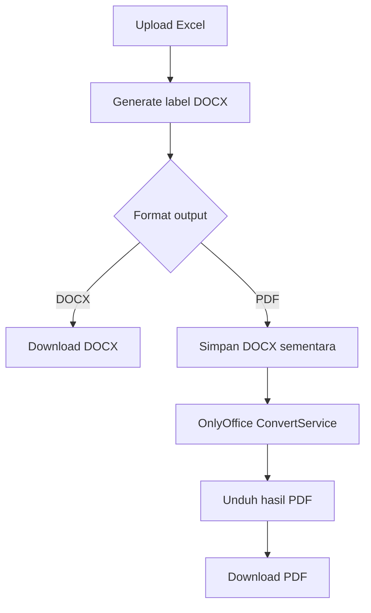

# Label Arsip

Aplikasi web sederhana untuk membuat **label arsip** dari file Excel dan mengunduh hasilnya sebagai **Word (`.docx`)** atau **PDF (`.pdf`)**.

## Fitur

- Upload file Excel berisi data arsip
- Generate buku label arsip secara otomatis
- Output default ke **Word (`.docx`)**
- Opsi konversi ke **PDF (`.pdf`)** melalui **OnlyOffice Document Server**
- UI web sederhana untuk proses upload dan download

## Teknologi

- Go
- [Gin](https://github.com/gin-gonic/gin)
- [Excelize](https://github.com/xuri/excelize)
- OnlyOffice Document Server (opsional, untuk output PDF)

## Struktur file penting

- `main.go` — entry point aplikasi dan handler utama
- `config.go` — pembacaan konfigurasi environment / `.env`
- `onlyoffice.go` — integrasi konversi DOCX ke PDF via OnlyOffice
- `templates/index.html` — halaman upload dan pilihan format output
- `templates/` — template HTML dan DOCX yang dipakai aplikasi

## Kebutuhan

- Go `1.26.2`
- File template di folder `templates/`
- OnlyOffice Document Server **opsional** bila ingin memakai output PDF

## Menjalankan aplikasi

Dari root project:

```sh
go run .
```

Aplikasi akan berjalan di:

```text
http://localhost:8080
```

## Format input Excel

Aplikasi membaca data dari sheet bernama:

```text
Sheet1
```

Baris pertama dianggap sebagai header. Setiap baris data minimal memiliki 4 kolom:

1. `No`
2. `Klas`
3. `Judul`
4. `Tahun`

Contoh:

| No | Klas | Judul | Tahun |
|----|------|-------|-------|
| 1 | Umum | Surat Masuk | 2024 |
| 2 | Keuangan | Laporan Bulanan | 2023 |

## Output DOCX

Tanpa konfigurasi tambahan, aplikasi tetap bisa berjalan dan menghasilkan file:

- `.docx`

Jika konfigurasi PDF belum lengkap, aplikasi akan menampilkan mode:

```text
Fitur PDF NONAKTIF
```

## Mengaktifkan output PDF

Fitur PDF menggunakan **OnlyOffice Document Server** untuk mengonversi dokumen `.docx` menjadi `.pdf`.

### Environment yang didukung

Aplikasi membaca konfigurasi dari:

1. Environment OS
2. File `.env` di root project

Jika key yang sama tersedia di environment OS, nilainya akan **mengalahkan** isi `.env`.

### Variabel konfigurasi

| Variable | Wajib | Default | Keterangan |
|---------|------|---------|------------|
| `ONLYOFFICE_URL` | Ya untuk PDF | `http://localhost:8026` | URL OnlyOffice Document Server |
| `ONLYOFFICE_JWT_SECRET` | Ya untuk PDF | - | Secret JWT OnlyOffice |
| `ONLYOFFICE_JWT_HEADER` | Tidak | `Authorization` | Header pembawa token JWT |
| `APP_INTERNAL_URL` | Ya untuk PDF | `http://localhost:8080` | URL aplikasi ini yang bisa diakses OnlyOffice |
| `MAX_CONCURRENT_JOBS` | Tidak | `2` | Batas pekerjaan berat paralel; cocok untuk VPS 2 core / 4 GB |

### Contoh file `.env`

```env
ONLYOFFICE_URL=http://localhost:8026
ONLYOFFICE_JWT_SECRET=isi-secret-onlyoffice-anda
ONLYOFFICE_JWT_HEADER=Authorization
APP_INTERNAL_URL=http://localhost:8080
MAX_CONCURRENT_JOBS=2
```

> `.env` sudah diabaikan oleh git agar secret tidak ikut ter-commit.

## Menjalankan OnlyOffice dengan Docker

Contoh paling sederhana:

```sh
docker run -i -t -d -p 8026:80 \
  -e JWT_ENABLED=true \
  -e JWT_SECRET=isi-secret-onlyoffice-anda \
  --name onlyoffice \
  onlyoffice/documentserver
```

Lalu samakan nilai `JWT_SECRET` di Docker dengan `ONLYOFFICE_JWT_SECRET` pada aplikasi.

## Rekomendasi untuk VPS 2 Core / 4 GB RAM

Untuk spesifikasi VPS ini, rekomendasi awal yang aman:

```env
MAX_CONCURRENT_JOBS=2
```

Alasannya:

- proses generate DOCX dan konversi PDF termasuk pekerjaan berat CPU/memori
- pembatasan 2 job paralel membantu mencegah lonjakan RAM dan CPU
- request lain tetap bisa antre dengan lebih stabil dibanding memaksa banyak proses paralel

Jika nanti hasil monitoring menunjukkan server masih longgar, nilai ini bisa dinaikkan bertahap ke `3`.

## Catatan penting integrasi PDF

- Endpoint internal dokumen sementara ada di `GET /internal/docx/:token`
- Endpoint ini dibatasi hanya untuk **loopback** (`localhost` / `127.0.0.1` / setara) 
- Artinya setup default paling aman bila:
  - aplikasi Go dan OnlyOffice berjalan di host yang sama, atau
  - OnlyOffice dapat mengakses aplikasi lewat loopback host
- Token dokumen bersifat:
  - acak
  - sekali pakai
  - memiliki masa berlaku singkat

## Cara pakai

1. Jalankan aplikasi
2. Buka `http://localhost:8080`
3. Upload file Excel
4. Pilih format output:
   - `Word (.docx)`
   - `PDF (.pdf)`
5. Klik **Mulai Proses & Unduh Label**

## Troubleshooting

### 1. PDF tidak bisa dipilih / gagal diproses
Periksa:

- `ONLYOFFICE_JWT_SECRET` sudah diisi
- `ONLYOFFICE_URL` benar
- `APP_INTERNAL_URL` benar
- OnlyOffice aktif dan bisa diakses

### 2. Muncul error token JWT tidak valid
Periksa apakah:

- secret di aplikasi sama dengan secret OnlyOffice
- nama header JWT sesuai konfigurasi server (`Authorization` secara default)

### 3. OnlyOffice gagal mengambil dokumen sumber
Periksa apakah `APP_INTERNAL_URL` benar-benar dapat diakses dari sisi OnlyOffice.

Untuk setup lokal/native, biasanya:

```env
APP_INTERNAL_URL=http://localhost:8080
```

### 4. File Excel gagal dibaca
Periksa bahwa:

- file benar-benar format Excel
- sheet bernama `Sheet1`
- data memiliki minimal 4 kolom sesuai format

## Pengembangan

Install dependency:

```sh
go mod download
```

Menjalankan aplikasi saat development:

```sh
go run .
```

## Catatan keamanan

- Jangan commit file `.env`
- Jangan membagikan `ONLYOFFICE_JWT_SECRET`
- Jika aplikasi akan dibuka ke jaringan yang lebih luas, pastikan konfigurasi URL internal dan reverse proxy ditinjau ulang

## Ringkasan alur PDF


